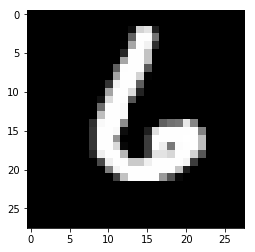

```python
import pandas
import numpy
from matplotlib import pyplot
```


```python
dataframe = pandas.read_csv('./train.csv')
print dataframe.shape
data_train = dataframe.values
print data_train.shape
```

    (42000, 785)
    (42000, 785)
    


```python
y_train = data_train[:, 0]
x_train = data_train[:, 1:]
print y_train.shape
print y_train.shape

pyplot.figure(0)

index_train = 1904

print y_train[index_train]

pyplot.imshow(x_train[index_train].reshape((28,28)), cmap='gray')
pyplot.show()
```

    (42000,)
    (42000,)
    5
    


```python
def distance(x1, x2):
    return numpy.sqrt(((x1 - x2)**2).sum())

def knn_algo(x_train, x, y_train, k=5):
    val = []
    for i in range(x_train.shape[0]):
        v = [distance(x, x_train[i, :]), y_train[i]]
        val.append(v)
        
    sort_val = sorted(val, key=lambda x: x[0])
    predicted_arr = numpy.asarray(sort_val[:k])
    predicted_arr = numpy.unique(predicted_arr[:, 1], return_counts = True)
    index_largest = predicted_arr[1].argmax()
    
    return predicted_arr, predicted_arr[0][index_largest]
```


```python
idq = int(numpy.random.random()*x_train.shape[0])
q = x_train[idq]


res = knn_algo(x_train[:10000], q, y_train[:10000], k=7)
print res

print y_train[idq]

pyplot.figure(0)
pyplot.imshow(q.reshape((28, 28)), cmap='gray')
pyplot.show()
```

    ((array([6.]), array([7])), 6.0)
    6
    





```python

```
